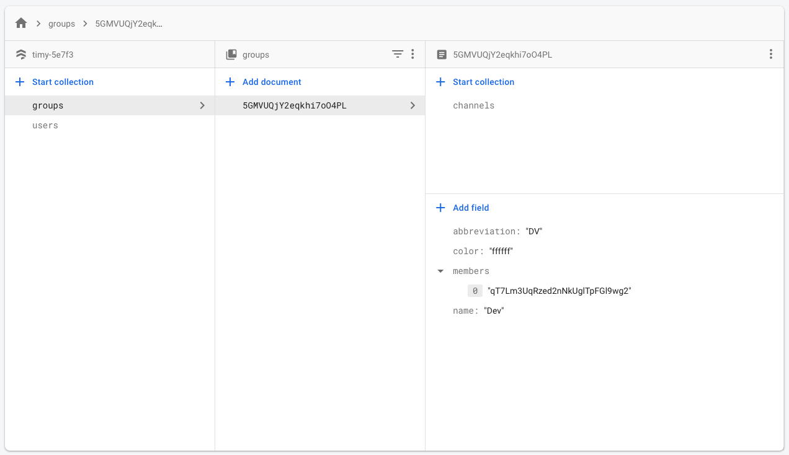
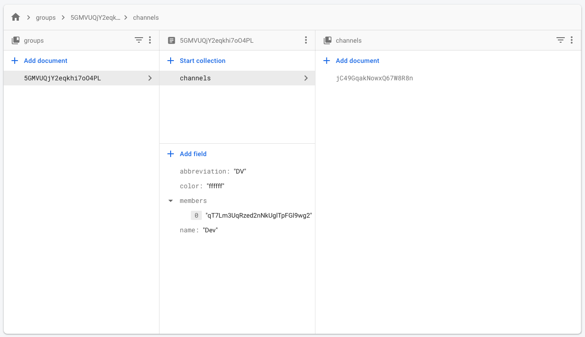
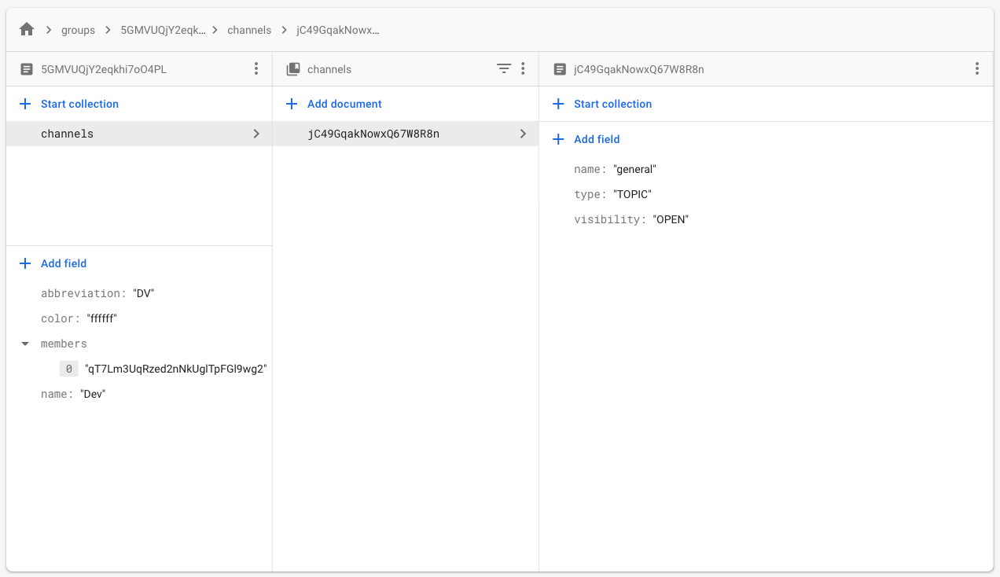
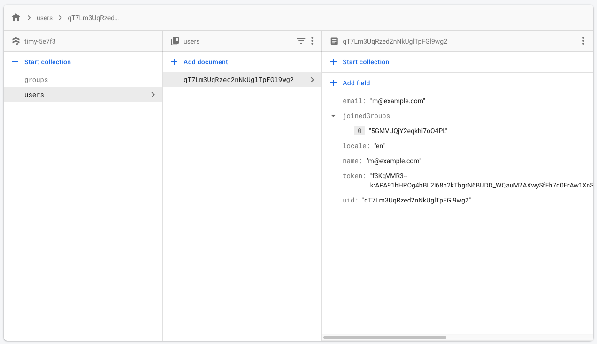

# Timy app

[](https://app.bitrise.io/app/1777d1ca81df02fb)

An amazing open-source group messaging app build with flutter. ✨

# Main Features

- Multiple groups (similar to Teams in Slack).
- Multiple *open or private* channels within groups.
- Sharing of photos and photo collections.
- React to messages with emoji. 
- Push-notifications for the message and channel updates.
- Specific channels for events (e.g. containing date, venue).
- Editing of event channels.
- Calendar for all upcoming and past events aggregated over all groups and channels.
- English and German localization.
- RSVP for events.


# Project Structure

This is a Flutter mobile app targeting Android and iOS.

The code for the Flutter app is contained in the folder `lib` and the
different native apps are in `android` and `ios`. Extra project assets are in
`assets` and `fonts`.

As well, this repo hosts a series of Firebase config files and cloud functions.

The documentation for Firebase part is inside the `firebase` folder.


# Prerequisites & Getting Started

## Client 

To build and run the mobile apps you’ll need to install [Flutter](https://flutter.dev) and its dependencies. To verify your installation run in the project’s root directory:**‌**

```
$ flutter doctor
```

The app is optimised for Android and iOS phones in portrait mode.

**IMPORTANT:** The project only supports Flutter version 1.10.5, you will have to change your configuration to it.
We cannot make sure that other Flutter versions will work.

```
$ flutter version 1.10.5
```

**Note:** Additionally you’ll need to setup the backend and add the GoogleService-Info of your Firebase app to your clients as described below.

## Backend (Firebase)

The backend is build using Firebase’s `node.js` SDK. All files are provided in the `firebase` folder. To deploy the code create an app and install the firebase CLI (See steps 1 & 2 in [Getting started](https://firebase.google.com/docs/functions/get-started)).

*Note: The following steps assume you’re using Firebases’ free `Spark Plan`. Therefore we’re performing the configuration manually.*

### B1. Setup sign-in method & adding users

An initial sign-in method needs to be configured.

- Select your project in [console.firebase.google.com](https://console.firebase.google.com). 
- Navigate to `Authentication` 
- Select `Sign-in methods` and activate `Email / Password`.

**Adding a user**

Currently, users need to be added *manually*.  

- In firebase navigate to `Authentication` and select `Users`. 
- Then `Add user`. 

Please copy the `User-UID` of the created user. We’ll need to add this ID to a group in the next step.

*Note: You’ll need to have at least one user configured to use the app.*

### B2. Configure firebase app

Next, you’ll need to configure your firebase app for Flutter as described in [Add Firebase to an App / Flutter](https://firebase.google.com/docs/flutter/setup)

**iOS**

- Enter iOS-Bundle-ID: `de.janoodle.circlesApp.debug`
- Download and rename `GoogleService-Info.plist` to  `GoogleService-Info-Dev.plist`.
- Copy file to `ios/Runner/Firebase`.

*NOTE: If you’re building for release you’ll additionally need to add a GoogleService-Info-Prod.plist pointing to your production Firebase app.*

**Android**

Follow the instructions in `android/README.md`.

### B3. Create and setup database
In the firebase console select `Database` under `Develop`  and create a Cloud Firestore Database. Setup database in `test mode` if you don't want to care about access permissions now.

At this point, **you need to run and perform login once** on the App, it will create a user document inside the `users` collection.

**You will see an empty screen. To fix that, continue this setup.** You may need to restart the app after the setup is done.

**Create group collection**

- Select the database you’ve just created.
- `Create collection` and name it `groups`.
- Add your first group with the following properties:

| name | type | value |
|:--|:--|:--|
| abbreviation | string | TE |
| color | string | ffffff |
| members | array | *User-UID we’ve retrieved in **Adding a user*** above |
| name | string | test |

We’ve now setup our fist test group. In addition to this step, we’ll need to setup a default `Channel` (e.g. something similar to `#general` in Slack).

**Add the new created Group id to the User document**

- Select the User you have now on your database.
- Add a new field named `joinedGroups` and make it type `Array`
- Add an entry in this array, with the value equal to the Group document id from Firestore.

**Create channel sub-collection**

- In the `groups` collection select the newly created group.  
- `Create collection` within the group called `channels`.
- Add your first channel with the following properties:

| name | type | value |
|:--|:--|:--|
| name | string | general |
| type | string | TOPIC |
| visibility | string | OPEN |

**Your Firestore database should look like this (with different ids)**





	
### B4. Deploy firebase functions 

Navigate to the `firebase` directory and deploy all functions using:

```
$ firebase deploy --only functions
```

Some features of the app can be used without Cloud Functions running, but some others will not work.
We recommend you to perform this step to enjoy all features.

### B5. Final steps

Login with the user you’ve created above.

Next create your first `event` to setup the *calendar collection* in our backend. 

**Create an event**

- In the app select the hamburger menu
- Hit the `+` sign next to `Events`
- Enter any data you like and hit `Create` 

At the root level of your database you should now see a collection called `calendar` in your firebase console.

Now we’re ready to deploy all other parts of our backend using:

```
$ firebase deploy
```


# Deployment

The app is setup to work with a development and production environment. We suggest you create a different Firebase app for each environment. 

When building for release the app will automatically use the production configuration that you’ve configured in step `B3`.

# External resources

- [Timy Messenger in itsallwidgets.com](https://itsallwidgets.com/timy-messenger)
- [Building a Messaging App in Flutter — Part I: Project Structure](https://medium.com/@MiBLT/building-a-messaging-app-in-flutter-part-i-project-structure-7d6db38783a5)
- [Building a Messaging App in Flutter — Part II: Main Method](https://medium.com/@MiBLT/building-a-messaging-app-in-flutter-part-ii-main-method-b3a70befbba5)

# About

The concept for Timy was created and developed by [kaalita](https://github.com/kaalita) and [philippmoeser](https://github.com/philippmoeser).
The initial version is a MVP messaging app focusing on organising events among groups.

We hope this project can be a reference or building block for your next flutter app. 🚀
